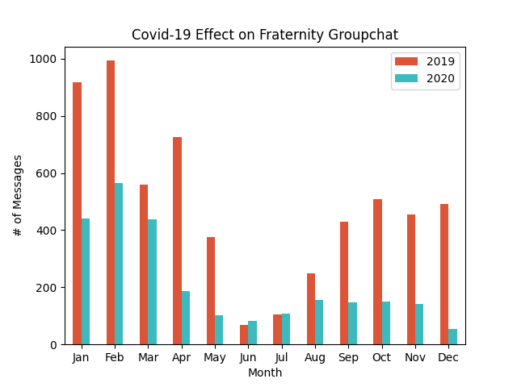

# Covid-Analysis-of-Fraternity-Groupchat
I noticed a decrease in messages in the fraternity's group chat and wanted to see if I was correct.

My fraternity at the University of Illinois at Urbana-Champaign primarily uses GroupMe to communicate. GroupMe allows you to be able to export your data from your various groupchats. Anyone can do this by going to their settings, clicking on 'Export My Data' and clicking which groupchat's data you would like to export.
    
After groupme is done extracting your data, they provide you with a .rar file. I took the 'messages.json' file and worked with that in my ide. I cleaned the data to leave only the 'created_at' as I didn't need any other data in the .json file. I converted the epoch timestamp to 'yyyy-mm-dd HH:mm:ss' format to make it easier to pull out the 2019 and 2020 data I wanted. Next, I split the data by 2019 and 2020 into pandas dataframes and provided a count of messages by month. When I was finished with that, I plotted my results.
    

    
Looking at the graph, we see a drastic decrease in the amount of messages due to Covid-19. We also see that there are spikes in January 2019 as the fraternity is happy to be back on campus. Every month besides summer months of June and July have a significant decrease in the amount of messages. Covid-19 has impacted everyones' lives and it was interesting to see how it affected my fraternity at UIUC.
